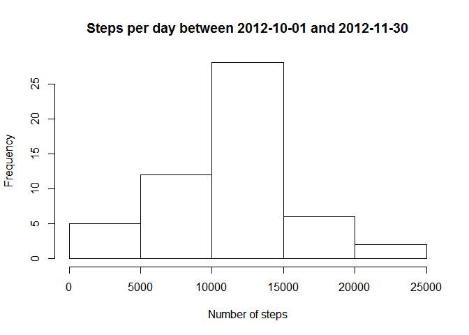
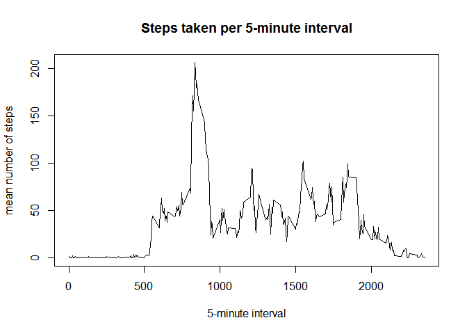
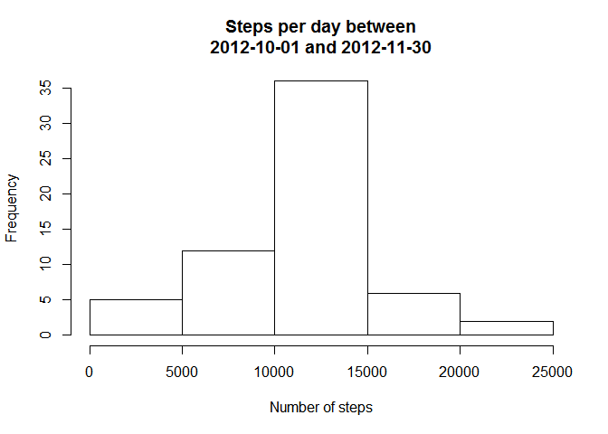
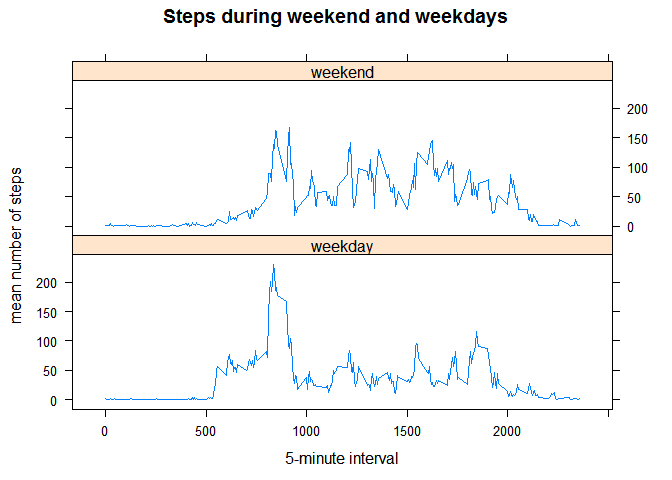

# Reproducible Research: Peer Assessment 1

Author: masswear  
Course: repdata-13, April 2015

## Loading and preprocessing the data

unzip the folder containing the data:

```r
unzip("activity.zip")
```

set path of data:

```r
path <- "activity.csv"
```

load the data, no further processing required (yet):

```r
raw_data <- read.csv(path)
```

store raw data in new variable "data" for further processing:

```r
data <- raw_data
```

## What is mean total number of steps taken per day?

We will use dplyr for grouping the data and calculating, so let's load package dplyr:

```r
library(dplyr)
```

Calculate the total number of steps taken per day:

```r
total_steps_day <- na.omit(data) %>%
                        group_by(date) %>%
                                summarize(total_steps = sum(steps))
```

The following histogram shows the total number of steps taken each day:

```r
hist(total_steps_day$total_steps, main = "Steps per day between 2012-10-01 and 2012-11-30", xlab = "Number of steps")
```

 

The summary function calculates the mean and median of the total number of steps taken per day:

```r
summary_steps <- summary(total_steps_day$total_steps)
```

```
##    Min. 1st Qu.  Median    Mean 3rd Qu.    Max. 
##      41    8841   10760   10770   13290   21190
```

## What is the average daily activity pattern?

Let's first calculate the mean number of steps taken per interval, using dplyr:

```r
mean_steps_interval <- na.omit(data) %>%
        group_by(interval) %>%
        summarize(mean_steps = mean(steps))
```

The time series plot shows a peak activity in the morning, and three smaller peaks throughout the day with mostly low activity in between:

```r
plot(mean_steps_interval, type="l", main = "Steps taken per 5-minute interval",
     xlab = "5-minute interval", ylab="mean number of steps")
```

 

Subsetting by the maximum of mean steps per interval gives the interval with the highest number of steps:

```r
subset(mean_steps_interval, mean_steps == max(mean_steps_interval$mean_steps))
```

```
## Source: local data frame [1 x 2]
## 
##   interval mean_steps
## 1      835   206.1698
```

## Imputing missing values

First, summing the missing values accross the dataset gives us the number of NAs:

```r
sum(is.na(data))
```

```
## [1] 2304
```

Since we have already calculated the mean number of steps per interval, this will be used to impute missing values. The merge function combines this information with the original data:

```r
data_impute <- merge(data, mean_steps_interval, by = "interval")
```

Missing values are replaced by the mean number of steps using the ifelse function:

```r
data_impute <- within(data_impute, steps <- ifelse(is.na(steps), mean_steps, steps))
```

Similar to the first question, total number of steps including imputed values are calculated with dplyr:

```r
total_steps_day_imputed <- data_impute %>%
        group_by(date) %>%
        summarize(total_steps = sum(steps))
```

Obviously, the imputation of missing values has not changed the histogram substantially on the extremes, but the center has increased:

```r
hist(total_steps_day_imputed$total_steps, main = "Steps per day between
2012-10-01 and 2012-11-30", xlab = "Number of steps")
```

 


Comparing the summary of the original data with the dataset after imputation shows an identical mean (because we have imputed that mean). The median now equals the mean:

```r
summary_steps_compare <- rbind(summary_steps, summary_steps_imputed = summary(total_steps_day_imputed$total_steps))
```

```
##                       Min. 1st Qu. Median  Mean 3rd Qu.  Max.
## summary_steps           41    8841  10760 10770   13290 21190
## summary_steps_imputed   41    9819  10770 10770   12810 21190
```

## Are there differences in activity patterns between weekdays and weekends?

The strptime function converts the variable "date" to class "date"

```r
data_impute$date <- strptime(data_impute$date, format = "%Y-%m-%d")
```

A new variable "days" differentiates between weekend (days 6=saturday) and 0=sunday) and weekdays. Converting it to a factor variable allows for grouping:

```r
data_impute <- within(data_impute, days <- ifelse(date$wday==6|date$wday==0, "weekend", "weekday"))
data_impute$days <- as.factor(data_impute$days)
```

Again, the mean number of steps per interval, grouped by weekday or weekend can be calculated with dplyr. Since dplyr cannot handle dates of format POSIXlt, dates are converted to POSIXct:

```r
data_impute$date <- as.POSIXct(data_impute$date)

mean_steps_interval_days <- data_impute %>%
        group_by(days, interval) %>%
        summarize(mean_steps = mean(steps))
```

Comparing the activity pattern between weekdays and weekends, weekday activity starts earlier and has a higher peak, but afterwards it's overall lower than weekend activity:


```r
library(lattice)

xyplot(mean_steps ~ interval | days,
       data = mean_steps_interval_days,
       layout = c(1,2),
       type = "l",
       main = "Steps during weekend and weekdays",
       xlab = "5-minute interval",
       ylab = "mean number of steps",
       )
```

 

